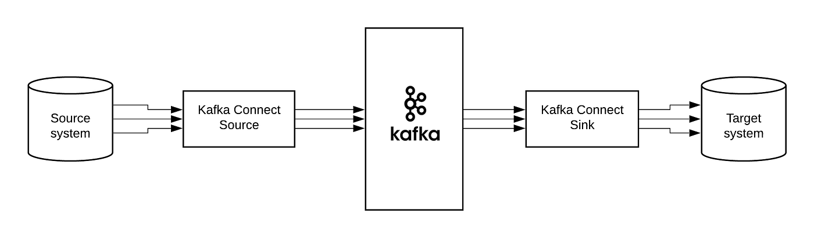
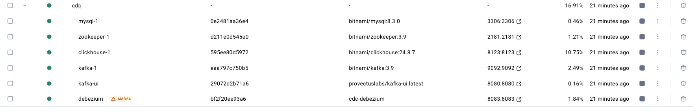
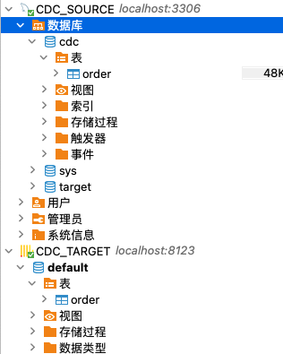
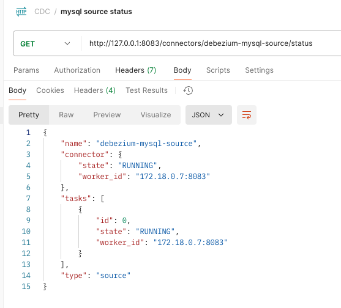
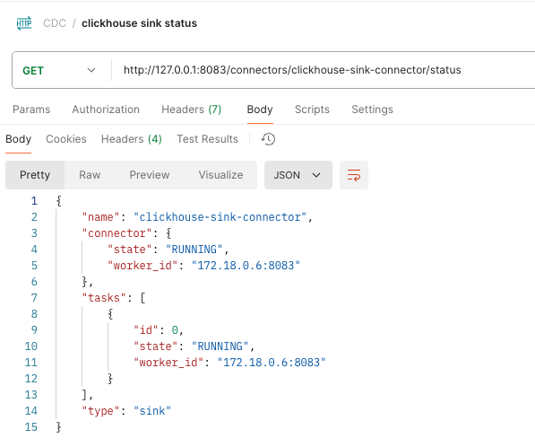
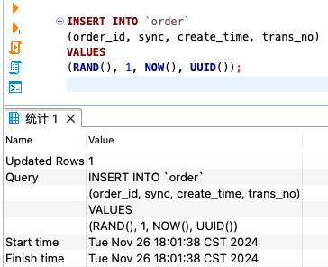
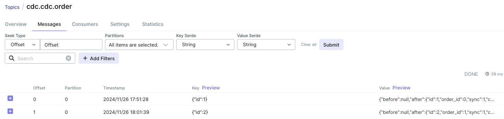
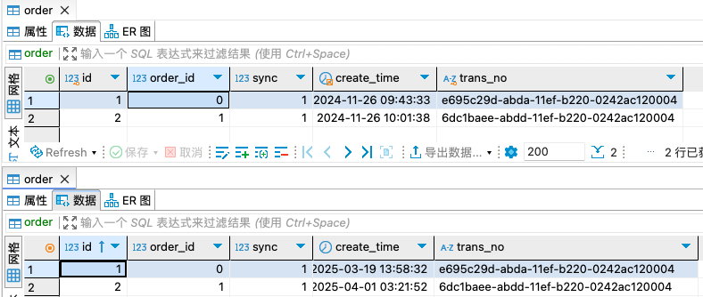

# 架構


## 原理
當有一個情境為物件 A 需要轉換為物件 Ｂ ，最直覺的設計就是製作可以直接轉換的 convertor，然而不同資料都有各自的編碼與格式，因此每多個物件就需要實作不同的 convertor，當物件變多的時候，就需要 (n * n-1)/2 個 convertor，為了拓展通用性，kafka connect 採用共通編碼作為溝通 Ａ -> C -> B，主要編碼為JSON、Avro、Protobuf，至於格式就依各自的定義決定，debezium source格式就與clickhouse sink格式不同，中間需要格式轉換才能成功對接。

## 組件說明
source 資料庫： mysql:8.3.0

target 資料庫： clickhouse:24.8.7

jar 依賴
- clickhouse-kafka-connect.jar clickhouse-sink-connector外掛檔案
- jna-5.15.0.jar jna解密 .so檔
- kafka-config-provider-pigo-1.0.jar kafka connect設定自訂密碼加解密使用

kafka connect plugins:

-  debezium
    - 官方文件：https://debezium.io/documentation/reference/stable/tutorial.html
    - 增量快照：https://debezium.io/blog/2021/10/07/incremental-snapshots/
    - 快速入門：https://aws.amazon.com/cn/blogs/china/debezium-deep-dive/
-  clickhouse-sink-connector
    - 官方文件：https://clickhouse.com/docs/en/integrations/kafka/clickhouse-kafka-connect-sink


## 環境架設
本測試docker compose包含整個測試環境所需docker image，僅需執行下列指令即可建立整個本地測試環境  
`docker compose up -d -f docker-compose-test.yml`  
  
    測試步驟
1. 先執行 mysql 與 clickhouse 資料夾的 init.sql  

2. 執行 curl 資料夾的 mysql_source 並執行 mysql_source_status 檢查狀態是否正常  

3. 執行 curl 資料夾的 clickhouse_source 並執行 clickhouse_source_status 檢查狀態是否正常  

4. 在 mysql 隨便插入一筆資料  

5. 查看 kafka topic 是否收到資料  

6. 查看 clickhouse 是否同步資料  


## kafka connect REST簡介
POST /connectors:  
建立一個新的connector

GET /connectors/{name}:  
取得指定的connector設定

GET /connectors/{name}/status:  
取得指定的connector狀態，包含運作中(RUNNING)、失敗(FAILED)、暫停(PAUSED)等狀態，也包含指定的worker、錯誤訊息以及這個connector的所有task狀態。

DELETE /connectors/{name}:  
刪除指定的connector。

## source connector config介紹
[Mysql source 範例](https://debezium.io/documentation/reference/stable/connectors/mysql.html#mysql-example-configuration)
僅列常用的
```json
{
    "name": "debezium-mysql-source",
    "config": {
        //connector class
        "connector.class": "io.debezium.connector.mysql.MySqlConnector", 
        "tasks.max": "1",

        //db info
        "database.hostname": "mysql", //mysql ip
        "database.port": "3306",
        "database.user": "root",
        "database.password": "${file:{sercet}:{key}", //專案自定義config file為固定值
        "database.server.id": "12345", //需為唯一值
        "database.include.list": "cdc", //要監控的資料庫

        //重要
        "event.deserialization.failure.handling.mode": "fail", //無法解析如何處理
        "event.converting.failure.handling.mode": "warn", //無法轉換如何處理
        "event.processing.failure.handling.mode": "fail", //無法運作如何處理
        "include.query": "false", //是否印sql
        "include.schema.changes": "true", //是否傳表結構異動資訊
        "table.include.list": "{databaseName}.{tableName}",
        "table.exclude.list": "{databaseName}.{tableName}",
        "time.precision.mode": "adaptive_time_microseconds",
        "topic.prefix": "source", //kafka topic的格式會是 source.<database>.<tableName>

        //snapshot
        "signal.data.collection": "{databaseName}.{signalTableName}", //可以送訊號給connector
        "snapshot.mode": "initial", //快照模式
        "snapshot.include.collection.list": "{databaseName}.{tableName}",
        "snapshot.select.statement.overrides": "{databaseName}.{tableName}",
        "snapshot.select.statement.overrides.{databaseName}.{tableName}": "SELECT * FROM {databaseName}.{tableName} WHERE delete_flag = 0 ORDER BY id DESC",

        //converter
        "key.converter": "org.apache.kafka.connect.json.JsonConverter",
        "key.converter.schemas.enable": "false", //是否攜帶schemas資訊
        "value.converter": "org.apache.kafka.connect.json.JsonConverter",
        "value.converter.schemas.enable": "false", //是否攜帶schemas資訊

        //schema
        "schema.history.internal.kafka.bootstrap.servers": "kafka:9092",//uses to write and recover DDL statements to the database schema history topic.
        "schema.history.internal.kafka.topic": "schema-changes.mysql"
    }
}
```
## sink connector config介紹
[Clickhouse sink 範例](https://clickhouse.com/docs/en/integrations/kafka/clickhouse-kafka-connect-sink#main-features)
僅列常用的
```json
{
  "name": "clickhouse-sink-connector",
  "config": {
    //connector class
    "connector.class": "com.clickhouse.kafka.connect.ClickHouseSinkConnector",
    "tasks.max": "1",

    //db info
    "hostname": "clickhouse", //clickhouse ip
    "port": "8123",
    "database": "default",
    "username": "default",
    "password": "${file:{sercet}:{key}",
    "ssl": "false",
    "errors.retry.timeout": "60",
    "jdbcConnectionProperties": "",

    "consumer.override.max.poll.records": "5000",
    "consumer.override.max.partition.fetch.bytes": "5242880",
    
    "exactlyOnce": "false", //設定為true 需設定clickhouse keeper
    "keeperOnCluster": "",
    "clickhouseSettings": "",
    "topics": "source.cdc.order", 
    "topic2TableMap": "source.cdc.order=order", //將topic 對應表名,

    "errors.tolerance": "all", //default:none
    "errors.deadletterqueue.topic.name": "<DLQ_TOPIC>",
    "errors.deadletterqueue.context.headers.enable": "true",
    
    "key.converter": "org.apache.kafka.connect.json.JsonConverter",
    "value.converter": "org.apache.kafka.connect.json.JsonConverter",
    "value.converter.schemas.enable": "false" //是否驗證schema
  }
}
```
## 注意事項
1. Clickhouse 需要預先建立好對應的資料庫
2. Clickhouse sink config 中 exactlyOnce，如果為true需要配置keeper的設定，為false代表資料寫入至少一次，要考慮重複插入情況
3. Clickhouse value 預設支援的格式為 JSONEachRow，schemas.enable要設成false
4. Clickhouse 不擅長update 與 delete，所以從 mysql 資料用插入新版本代替更新操作
5. 當 xxx.converter.schemas.enable 為 true 的情況下，sink connector會驗證 source傳來的schema，所以 xxx.converter.schemas.enable的值 source 與 sink需保持一致，具體請參考[這篇](https://www.confluent.io/blog/kafka-connect-deep-dive-converters-serialization-explained/)